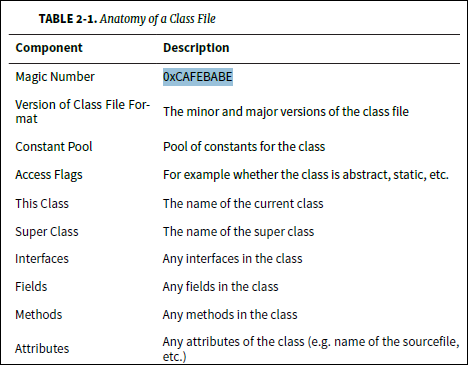
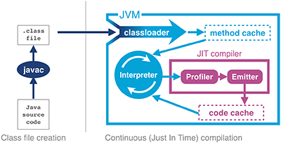

# Chapter 2 JVM 이야기

## 2.1 인터프리팅과 클래스로딩

- JVM은 스택기반의 해석 머신<sup>interpreted machine</sup>이다.
- JVM 인터프리터의 기본 로직은, 평가 스택을 이용해 중간 값들을 담아두고, 가장 마지막에 실행된 명령어와 독립적으로 프로그램을 구성하는 옵코드<sup>opcode</sup>를 하나씩 처리하는 'while 루프 안의 switch문'이다.
- HellowWorld.class에 있는 main() 메서드에 제어권을 넘기려면 가상머신이 실행되기 전에 이 클래스를 로드해야 한다. 이 때 자바 클래스로딩<sup>class-loading</sup> 매커니즘이 동작한다.
- 최초 부트스크랩 클래스가 실행 되며 차례로 확장 클래스로더, 애플리케이션 클래스로더가 생성된다.
- 자바는 프로그램 실행 중 처음 보는 클래스가 있으면 디펜던시를 통해 로드한다.
- 보통 자바는 클래스 로드 시점이 런타임이다.

## 2.2 바이트코드 실행

- 자바는 javac를 이용해 컴파일 된다.
- JVM의 J는 예전에는 Java였으나 현재는 JVM 자체가 규격이 되어 Java라고 부르기 모호해졌다. JVM 구현체로는 스칼라도 있다.



- 클래스 파일의 버전 정보는 클래스로더의 호환성 보장을 위해 존재한다. 지원하지 않는 버전을 만나게 되면 UnsupportedClassVersionError가 발생한다.
- JVM은 코드 실행시 런타임에 배치된 메모리 대신, JVM 내부의 상수 풀<sup>constant pool</sup>을 참조한다.
- 아래 코드를 javac로 컴파일하고 javap 명령어를 이용하면 자바 내부를 들여다 볼 수 있다.
```java
public class HelloWorld {
    public static void main(String[] args) {
        for (int i=0; i<10; i++) {
            System.out.println("Hello World");
        }
    }
}
```

```jvm
public class HelloWorld {
  public HelloWorld();
    Code:
       0: aload_0
       1: invokespecial #1                  // Method java/lang/Object."<init>":()V
       4: return

  public static void main(java.lang.String[]);
    Code:
       0: iconst_0
       1: istore_1
       2: iload_1
       3: bipush        10
       5: if_icmpge     22
       8: getstatic     #2                  // Field java/lang/System.out:Ljava/io/PrintStream;
      11: ldc           #3                  // String Hello World
      13: invokevirtual #4                  // Method java/io/PrintStream.println:(Ljava/lang/String;)V
      16: iinc          1, 1
      19: goto          2
      22: return
}
``` 

### 참고자료
- class 파일 포멧 구조
  - https://blog.lse.epita.fr/articles/69-0xcafebabe-java-class-file-format-an-overview.html
  - https://www.viralpatel.net/tutorial-java-class-file-format-revealed/
- JVM Opcode
  - https://jrebel.com/rebellabs/rebel-labs-report-mastering-java-bytecode-at-the-core-of-the-jvm/2/
  - https://en.wikipedia.org/wiki/Java_bytecode_instruction_listings
 

## 2.3 핫스팟 입문
- 핫스팟 덕분에 자바는 C/C++ 같은 언어에 필적할 만한 성능이 되었다.
- 핫스팟은 프로그램의 런타임 동작을 분석하고 최적화를 적용하는 가상 머신이다.
- 핫스팟 VM의 목표는 자연스럽게 자바 코드를 작성하고 바람직한 설계 원리를 따르도록 하는 것이다.



### 2.3.1 JIT 컴파일이란?

- 핫스팟은 프로그램 단위(메서드와 루프)를 인터프리티드 바이트코드에서 네이티브 코드로 컴파일한다. 바로 *JIT*<sup>just-in-time</sup> 컴파일이라고 알려진 기술이다.
- 핫스팟은 인터프리티드 모드로 실행하는 동안 애플리케이션을 모니터링하면서 가장 자주 실행되는 코드를 JIT 컴파일 수행한다.
- JIT 컴파일의 장점은 컴파일러가 해석 단계에서 수집한 추적 정보를 근거로 최적화를 한다는 것이다.
- 자바와 같이 프로필 기반 최적화<sup>profile-guided optimization</sup>(PGO)를 응용하는 환경에서는 *동적 인라이닝*<sup>dynamic inlining</sup> 또는 가상 호출<sup>virtual call</sup> 등으로 성능 개선을 할 수 있다.
- 자바의 철학은 제로-오버헤드 추상화를 전혀 따르지 않으므로 고성능 자바 애플리케이션을 개발하는 사람들은 '상식적인 추론'만으로 자바 프로그래밍을 해서 안 된다.

### 참고자료
- https://www.slideshare.net/IonutBalosin/from-bytecode-to-native-code-in-hot-spot-jvm


## 2.4 JVM 메모리 관리

- 자바는 가비지 컬렉터라는 프로세스를 이용해 힙 메모리를 자동 관리하는 시스템을 가지고 있다.

## 2.5 스레딩과 자바 메모리 모델(JMM)

- 대부분의 JVM 구현체에서 자바 애플리케이션 스레드는 정확히 하나의 전용 OS 스레드와 1:1 대응한다.
- 1990년대 후반부터 자바의 멀티스레드 방식은 아래 3가지 기본 설계 원칙에 기반한다.
  - 자바 프로세스의 모든 스레드는 가비지가 수집되는 하나의 공용 힙을 가진다.
  - 한 스레드가 생성한 객체는 그 객체를 참조하는 다른 스레드가 엑세스 할 수 있다.
  - 기본적으로 객체는 Mutable 이다. 즉, 객체 필드에 할당된 값은 개발자가 애써 `fianl`을 사용하여 Immutable로 표시하지 않는 한 바뀔 수 있다.
  
 ## 2.6 JVM 구현체 종류
 
 - OpenJDK
 - 오라클 자바
 - 줄루(Zulu)
 - 아이스티(IcedTea)
 - 징(Zing)
 - J9
 - 애비안(Avian)
 - 안드로이드(Android)
 
 ### 2.6.1 JVM 라이선스
 - 오라클 JDK와 OpenJDK는 라이선스 외에는 동일하다. 하지만 오라클 JDK 사용시 개발자는 다음 2가지를 유의해야 한다.
   - 회사 밖으로 오라클 바이너리(도커 이미지 등)를 재배포하는 행위는 허용되지 않는다.
   - 사전 동의 없이 오라클 바이너리를 함부로 패치해서는 안 된다.
   
 
 ## 2.7 JVM 모니터링과 툴링
 - JMX<sup>Java Management Extensions</sup>
 - Java Agent
 - JVM Tool Interface(JVMTI)
 - Serviceabillity Agent(SA)