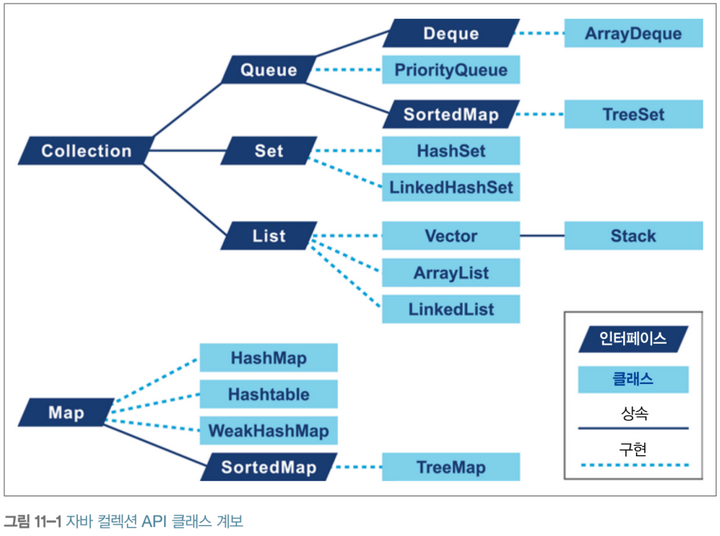
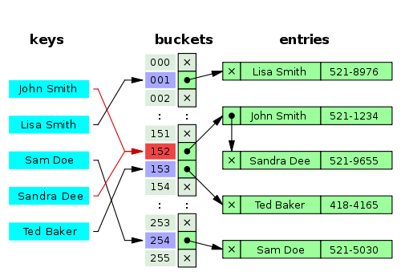
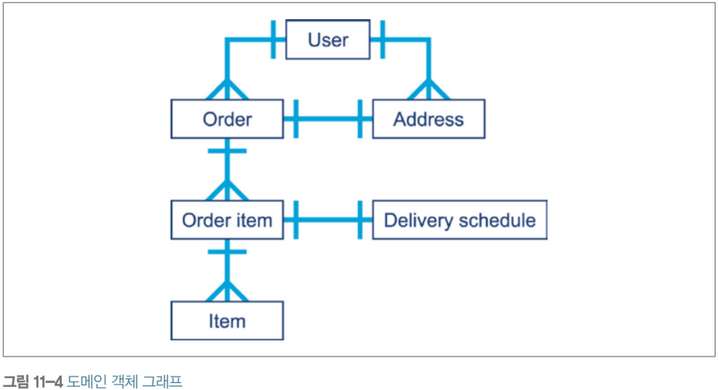
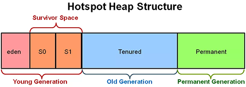

# Chapter 11 자바 언어의 성능 향상 기법

- 코드 설계는 네트워크 연결, I/O, DB 등의 애플리케이션 외부 요인 다음으로 병목을 일으킬 확률이 높은 부분이다.

## 11.1 컬력션 최적화
- 대부분의 프로그래밍 언어 라이브러리는 최소한 2가지 컨테이너를 제공한다.
  - 순차 컨테이너<sup>sequential container</sup> : 수치 인덱스료 표기한 특정 위치에 객체를 저장 
  - 연관 컨테이너<sup>associative container</sup> : 객체 자체를 이용해 컬렉션 내부에 저장할 위치를 결정

- 컨테이너에 저장되는 것은 객체를 가리키는 레퍼런스이다.
- 따라서 C/C++ 형식의 배열 또는 백터와 같은 성능을 얻을 수 없다.
- 자바는 저수준 메모리 제어와 저수준 메모리 레이아웃 제어가 불가능 하다.
- ObjectLayout 웹사이트(http://objectlayout.org) 에는 레이아웃을 표준화할 수 있는 방법과, 자바 7 이상에서 컴파일/실행 가능한 코드가 있다.

 
 
- 설계 요건에 알맞는 구현체를 선택하는 것도 중요하지만, 그 선택의 결과가 애플리케이션 전체 성능에 영향을 끼칠 수 있으므로 주의 해야 한다.
 
## 11.2 List 최적화
 
- 자바에서는 리스트를 아래 2가지 기본형태로 나타낸다.
  - ArrayList
  - LinkedList

> Stack, Vector 같은 클래스도 있지만 Stack의 거의 쓸데 없는 추가 로직만 갖고 있고, Vector는 완전히 Deprecated 된 클래스이다. Vector를 사용한 코드가 발견되면 반드시 제거해야 한다.


### 11.2.1 ArrayList

- ArrayList는 고정 크기에 배열에 기반한 리스트이다.
- 배열의 최대 크기만큼 원소를 추가할 수 있고, 배열이 꽉 차면 더 큰 배열을 새로 만들고 기존 값을 복사한다.
- ArrayList는 처음에는 빈 배열이고, 최초 원소가 추가 되면 용량 10인 배열을 할당한다.
- 초기 용량값을 생성자로 설정할 수 있다.

```text
크기 조정은 성능 비용을 유발하는 작업이므로 용량은 가급적 미리 설정하는 것이 좋다.
```

```java
@Benchmark
public List<String> properlySizedArrayList() {
    List<String> list = new ArrayList<>(1_000_000);
    for (int i=0; i < 1_000_000; i++) {
        list.add(item);
    }
    return list;
}

@Benchmark
public List<String> resizingArrayList() {
    List<String> list = new ArrayList<>();
    for (int i=0; i < 1_000_000; i++) {
        list.add(item);
    }
    return list;
}
```

```text
Benchmark                  Mode    Cnt      Score       Error    Units
------------------------------------------------------------------------
properlySizedArrayList    thrpt     10    287.388    ± 7.135    ops/s
resizingArrayList         thrpt     10    189.510    ± 4.530    ops/s
```

- properlySizedArrayList 테스트가 원소 추가 작업을 초당 약 100회 더 처리했다.

### 11.2.2 LinkedList

- LinkedList는 이중 연결 리스트<sup>doubly linked list</sup>로 구현되어 있어 리스트에 덧붙이는 작업은 항상 O(1) 이다.

### 11.2.3 ArrayList vs LinkedList

- 원소를 추가하는 작업의 벤치마크는 아래와 같으며, 원소 삭제의 경우도 아래 결과와 비슷하다.
```text
Benchmark      Mode    Cnt      Score        Error    Units
-------------------------------------------------------------
ArrayList     thrpt     10      3.402    ±  0.239    ops/s
LinkedList    thrpt     10    559.570    ± 68.629    ops/s
```

- 원소를 랜덤 엑세스 하는 경우에는 ArrayList가 정답이다. 모든 원소를 O(1) 시간만에 가져올 수 있기 때문이다.

```text
Benchmark      Mode    Cnt         Score           Error    Units
-------------------------------------------------------------------
ArrayList     thrpt     10   269,568.627    ± 12972.927    ops/s
LinkedList    thrpt     10         0.863    ±     0.030    ops/s
```

- ArrayList는 가급적 미리 적당한 크기를 지정하여 중간에 다시 사이즈를 조정하는 일이 없게 하는 것이 좋다.

## 11.3 Map 최적화

### 11.3.1 HashMap

- 좀 더 자세한 내용은 네이버 D2 강의를 보는 것이 좋다. (https://d2.naver.com/helloworld/831311) 
- HashMap 축소 버전에 들어 있는 핵심 메서드는 아래와 같다.

```java
public Object get(Object key) {
    // 편의상 null 키는 지원하지 않음
    if (key == null) return null;
    
    int hash = key.getHash();
    int i = indexFor(hash, table.length);
    for (Entry e = table[i]; e != null; e = e.next) {
        Object k;
        if (e.hash == hash && ((k = e.key) == key || key.equals(k)))
            return e.value;
    }
    
    return null;
}

private int indexFor(int h, int length) {
    return h & (length-1);
}

// 연결 리스트 노드
static class Node implements Map.Entry {
    final int hash;
    final Object key;
    
    Object value;
    Node next;
    
    Node(int h, Object k, Object v, Entry n) {
        hash = h;
        key = k;
        value = v;
        next = n;
    }
}
```
- Key-Value 쌍을 저장하는 방법으로는 Open Addressing과 Separate Chaining이 있는데 자바는 Separate Chaining 방식을 사용한다.
- 위 소스코드의 indexFor를 통해 배열의 인덱스를 구하고 Node를 저장한다. 이 때 중복 인덱스가 있는 경우 LinkedList를 통해 원소를 추가한다.
- Separate Chaining 배열의 각 원소를 버킷이라고 부른다.



- HashMap 생성자에는 `initialCapacity`와 `loadFactor`가 있다. 이 2개는 HashMap 성능에 가장 큰 영향을 미친다.
- initalCapacity는 버킷의 개수를 지정할 수 있다. (디폴트 16)
- 가능한 HashMap도, ArrayList와 동일하게, 저장할 데이터의 양이 예측가능하다면 initialCapacity를 이용하여 크기를 미리 정하는 것을 추천한다.
- loadFactor는 버킷의 용량을 2배 증가 시키는 한계치를 의미한다. 기본값은 0.75이다.
  > 버킷이 100개이고 loadFactor가 0.75인 경우, 75개 버킷이 채워지면, 버킷이 200으로 늘어난다.
- 재해시<sup>refresh</sup>는 버킷의 용량을 2배로 늘리고 저장된 데이터를 다시 배치한 다음, 해시를 다시 계산하는 과정을 말한다.
- 최대 원소 개수를 loadFactor로 나눈 값을 initialCapacity로 설정하면 재해시가 발생하지 않는다.
- initialCapacity와 loadFactor를 높게 잡으면 순회시 성능에 안 좋은 영향을 끼친다.

```java
static final int TREEIFY_THRESHOLD = 8;
static final int UNTREEIFY_THRESHOLD = 6;  
```
- 자바 8부터는 하나의 버킷에 Key-Value 쌍이 8개가 모이면 HashMap 내부 자료구조를 트리로 변경하여 TreeMap 처럼 동작 한다.

#### LinkedHashMap

- LinkedHashMap은 순서가 중요한 코드에서 쓸 수 있으나, 대체적으로 Map은 순서가 중요하지 않아 쓸 일이 많지 않다. 
- LinkedHashMap의 기본 관리모드는 삽입 순서이지만, 엑세스 순서 모드로 변경할 수 있다.


### 11.3.2 TreeMap

- TreeMap은 특정 지점부터 특점 지점까지 데이터를 분할하는 일이 많은 경우 유용하게 쓸 수 있다.
- TreeMap의 get(), put(), containsKey(), remove() 메소드가 log(n) 성능을 보장한다.
- 스트림이나 람다로 Map 일부를 처리해야할 때 TreeMap을 쓰면 좋다.

### 11.3.3 MultiMap은 없어요
- 자바는 MultiMap (하나의 키에 여러 값을 묶은 맵) 구현체를 제공하지 않는다.

## 11.4 Set 최적화

- 자바에는 3 종류 Set이 있고, 고려해야할 사항은 Map과 비슷하다.
- 실제로 HashSet 내부를 보면 HashMap으로 구현 되어 있다.
- HashSet 삽입/삭제, contains 의 복잡도는 O(1) 이다.
- 원소의 순서는 보장되지 않는다.
- 순회 비용은, Map와 마찬가지로, initialCapacity, loadFactor에 따라 달라진다.
- TreeSet 역시 내부적으로 TreeMap을 이용한다.
- TreeSet은 Comparator에 정의한 순서대로 키 순서를 유지하므로 범위 기반 작업 및 순회 작업을 할 수 있다.
- TreeSet의 복잡도는 log(n)이다.
 
## 11.5 도메인 객체
- `도메인 객체`는 애플리케이션에 유의미한 비지니스 컨셉을 나타낸 코드이다.
- 커머스 시스템이라면 Order, OrderItem, Delivery 등이 도메인 객체이다.
- 도메인 객체는 대부분 타입 간에 서로 연관 되어 있다. (예를 들면 Order 하나에는 여러 OrderItem이 매핑됨)
 

 
- 자바 힙에 관한 기본적인 사실은 아래와 같다.
  - 가장 흔히 할당되는 자료 구조는 String, char 배열, byte 배열, Collection 타입 인스턴스이다.
  - jmap에서 누수되는 데이터는 비정상적으로 비대한 데이터셋으로 나타난다.
- 메모리 점유량과 인스턴스 개수 모두 대부분 코어 JDK에 있는 자료 구조가 상위권을 형성한다.
- 애플리케이션에 속한 도메인 객체가 jmap 결과치의 상위 30위 정도 안에 위치한다면 메모리 누수가 발생한 신호라고 볼 수 있다.
- 메모리 누수를 일으키는 도메인 객체는 `전체 세대`<sup>all generations</sup> 효과를 일으킨다.
  > GC에 수집되어야 할 객체가 수집되지 않고 테뉴어드 세대까지 살아있다. 이 때 세대 카운트별(자료형별) 바이트 히스토그램을 찍어보면 누수를 일으킬 가능성이 높은 도메인 객체가 전체 세대에 걸처 분포하게 된다. 
- 이를 대처하려면 도메인 객체에 대응되는 데이터셋의 크기를 살피고 그 수치가 온당한지, 그리고 작업 세트(물리적으로 할당된 메모리 페이지 그룹)에 존재하는 도메인 객체 수가 예상 범위 내에 들어 있는지 확인해야 한다.
- 단명 도메인 객체는 부유 가비지 문제를 일이킬 가능성이 농후하다.
- 도메인 객체는 메모리 누우세 더 취약하다.
- 성능이 중요한 시스템에서는 도메인 객체의 도메인을 인식하고 그에 알맞는 크기의 작업 세트가 배정되도록 해야 한다.

## 11.6 종료화 안 하기 (Avoid Finalization)
- 자바 finalize() 메서드는 자동으로 리로스를 관리하려고 만든 장치이다.
- 리소스의 소유권은 객체 수명과 동일하게 하는 것은 반드시 필요하다.
- *하지만 자바에서는 finalize()는 절대 사용하지 말아야 한다. 자바 9 부터는 finalize()가 Deprecated 되었다.*
  > finalize() 로 리소스 해제를 처리하게 되면 아래와 같은 과정을 통해 즉시 회수되지 않는다. 
  1. finalize 가능한 객체는 큐로 이동한다.
  2. 애플리케이션 Thread 재시작 후, 별도의 finalize Thread가 큐에서 객체를 하나씩 꺼내 finalize() 메서드를 실행한다.
  3. finalize()가 종료되면 객체는 다음 사이클에 진짜 수집될 준비를 마친다.
- finalize() 실행 중 예외가 발생하면 아무런 행동을 취하지 않고 그냥 무시된다. 개발자는 전혀 예외 상황을 인지할 수 없다.
- 또한 종료화 과정에 블로킹 작업이 있을지 모르니 JVM은 Thread를 하나 더 만들어 finalize() 메서드를 실행하게 되어 오버헤드가 발생한다.
- *finalize() 메서드를 오버라이드 한 코드가 있다면 반드시 리팩토링 하라!*

### 11.6.3 try-with-resource

- 자바 7부터 추가된 try-with-resource 생성자를 이용하면 자동으로 리소스를 해제해 준다.
```java
public void readFirstLineNew(File file) throws IOException {
    try (BufferedReader reader = new BufferedReader(new FileReader(file))) {
        String firstLine = reader.readLine();
        System.out.println(firstLine);
    }
}
```
- 블록 범위 안에서만 리소스에 접근할 수 있는 제약이 있지만, try-with-resource는 강력히 추천하는 베스트 프랙티스이다.
- try-with-resource는 컴파일 타임 기능이며, 상당히 큰 바이트코드로 변환되므로 컴파일 과정에 안 좋은 영향을 끼칠 수 있다.

## 11.7 메서드 핸들

- 메서드 핸들은 invokedynamic 호출부에 의해 호출되는 메서드를 나타낸 객체이다. 
- 리플렉션은 컴파일 타임에는 메서드가 어떻게 호출될지 전혀 알 수 없다.
```java
MethodType mt = MethodType.methodType(int.class);
MethodHandles.Lookup l = MethodHandles.lookup();
MethodHandle mh = l.findVirtual(String.class, "hashCode", mt);

String receiver = "b";
int ret = (int)mh.invoke(receiver);
System.out.println(ret);
```
- 리플렉션의 setAccessible() 자바의 안전한 액세스 체계에 큰 허점을 노출시킨다.
- 반면 메서드 핸들은 보이지 않는 메서드를 엑세스 할 수 없다. (IllegalAccessException 발생)
 