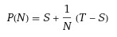
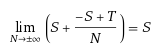
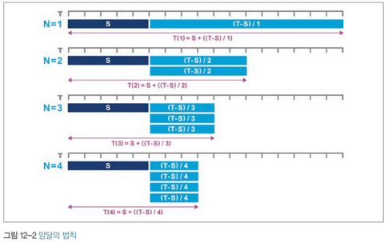
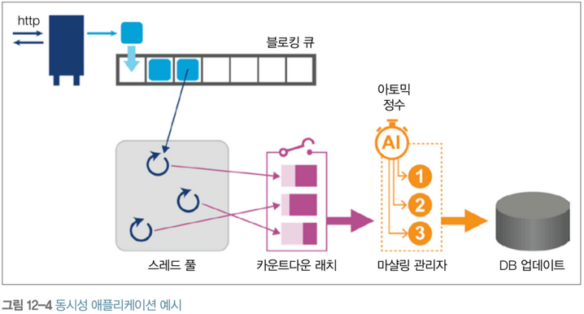
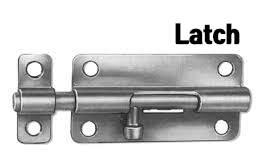
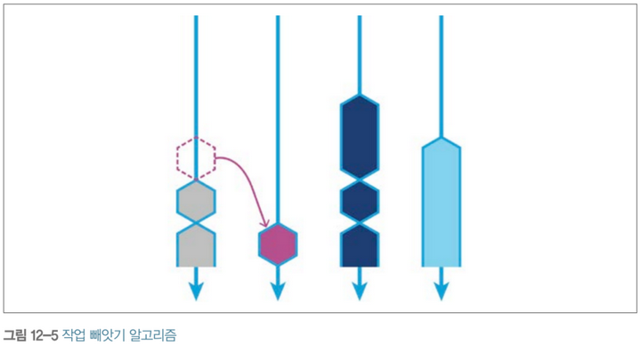

# Chapter 12 동시 성능 기법

- 공짜 점심은 끝났다<sup>The Free Lunch Is Over</sup>

## 12.1 병렬성이란?

> - 순차 실행 파트 = S
> - 자유롭게 사용 가능한 프로세서 개수 = N
> - 총 태스크 소요 시간 = T
> - 프로세서 개수의 함수 = P(N)
 
이 때 태스크 소요시간 식은 아래와 같다.



- 프로세서를 무한히 증가시켜도 총 소요 작업 시간은 순차 작업 시간 이상 줄어 들 수 없다.



- 위 식은 암달의 법칙을 뒷받침하는 기반 이론이며, 이를 그림으로 나타내면 [그림 12-2]와 같다.



- 병렬 태스크나 다른 순차 태스크 간에 소통할 필요가 전혀 없는 경우 이론적으로 속도는 무한히 높일 수 있고, 이런 부류의 워크로드를 `낯간지러운 병렬`<sup>embarrassingly parallel</sup> 이라고 한다.
> 이 책에서는 낯간지러운 병렬이라고 표현하고 있으나 일반적으로는 '처치 곤란 병렬' 이라는 용어를 쓴다. (https://ko.wikipedia.org/wiki/%EC%B2%98%EC%B9%98_%EA%B3%A4%EB%9E%80_%EB%B3%91%EB%A0%AC)

### 12.1.1 자바 동시성 기초

- 멀티쓰레드 환경에서 아래 코드는 결과를 보장할 수 없다.

```java
public class Counter {
    private int i = 0;
    
    public int increment() {
        return i = i + 1;
    }
}

public class CounterExample implements Runnable {
    private final Counter counter;
    
    public CounterExample(Counter counter) {
        this.counter = counter;
    }
    
    @Override
    public void run() {
        for (int i = 0; i < 100; i++) {
            String tName = Thread.currentThread().getName();
            System.out.println(tname + " Value : " + counter.increment());
        }
    }    
}
```
- 자바 5 이전에는 `synchronized` 키워드로 감싸는 방법이 유일했다.
- 하지만 아무 생각 없이 synchronized만 추가하면 프로그램이 느려질 수도 있다.
- 병렬화 작업을 진행할 때는 성능 테스트가 반드시(!) 수반 되어야 한다.
 
## 12.2 JMM<sup>Java Memory Model</sup>의 이해

- JMM 다은 다음 질문에 답을 찾는 모델이다.
  - 두 코어가 같은 데이터를 엑세스하면 어떻게 되는가?
  - 언제 두 코어가 같은 데이터를 바라본다고 장담할 수 있는가?
  - 메모리 캐시는 위 두 질문의 답에 어떤 영향을 미치는가?

- 자바 플랫폼은 공유 상태를 어디스 엑세스하든지 순서에 관한 보장과 여러 쓰레드에 대한 업데이트 가시성 보장을 반드시 지킨다.
- 고수준의 JMM 같은 메모레 모델은 2가지 방식으로 접근 한다.
> 강한 메모리 모델
> - 전체 코어가 항상 같은 값을 바라본다.
>
> 약한 메모리 모델 
> - 코어마다 다른 값을 바라볼 수 있고 그 시점을 제어하는 특별한 캐시 규칙이 있다.

- JMM은 아주 약한 메모리 모델이며 다음 기본 개념을 기반으로 애플리케이션을 보호한다.
  - Happens-Before (~보다 먼저 발생) : <br/>한 이벤트는 무조건 다른 이벤트보다 먼저 발생
  - Synchronizes-With (~와 동기화) : <br/>이벤트가 객체 뷰를 메인 메모리와 동기화 
  - As-If-Serial (순차적인 것처럼) : <br/>실행 쓰레드 밖에서는 명령어가 순차 실행 되는 것처럼 보임
  - Release-Before-Acquire (획득하기 전에 해제) : <br/>한 쓰레드에 걸린 락을 다른 쓰레드가 그 락을 획득하기 전에 해제
- 자바에서 쓰레드는 객체 상태 정보를 스스로 들고 있다.
- 쓰레드가 변경한 내용은 메인 메모리에 반영되고 같은 데이터를 엑세스하는 다른 쓰레드가 다시 읽는 구조이다.
- 자바 `synchronized` 키워드는 활성화 된 쓰레드의 로컬 뷰가 메인 메모리와 동기화 되었다는 의미다.
- synchronized의 한계점은 아래와 같다.
  - 락이 걸린 객체에서 일어나는 동기화 작업은 모두 균등하게 취급
  - 락 획득/해제는 반드시 메서드 수준이나 메서드 내부의 동기화 블록 안에서 이루어져야 한다.
  - 락을 얻지 못하는 쓰레드는 블로킹 된다. 락을 얻지 못할 경우, 락을 얻어 처리를 계속하려는 시도 조차 불가능하다.
- 읽기/쓰기 모두에 synchronized를 적용해야 문제가 발생하지 않는다.

## 12.3 동시성 라이브러리 구축

- java.util.concurrent 라이브러리를 쓰면 '쓰레드 핫' 성능도 함께 좋아진다.
- 이 라이브러리의 핵심 요소는 아래처럼 분류 된다.
  - 락, 세마포어
  - 아토믹스
  - 블로킹 큐
  - 래치
  - 실행자



- 일부 라이브러리는 CAS<sup>Compare And Swap</sup>를 구현하기 위해 저수준 프로세서 명령어 및 OS별 특성을 사용한다.
- CAS는 '예상되는 현재 값'과 '원하는 새 값', 그리고 메모리 위치(포인터)를 전달받아 다음 2가지 일을 하는 아토믹 유닛이다.
  1. 예상되는 현재 값을 메모리 위치에 있는 콘텐츠와 비교
  2. 구 값이 일치하면 현재 값을 원하는 새 값으로 교체
- 최신 프로세스는 대부분 CAS 기능을 지원하지만 자바 플랫폼 명세서는 CAS 이야기가 나오지 않는다.
- CAS는 sun.misc.Unsafe 클래스를 통해 엑세스 가능하다.

### 12.3.1 Unsafe

- sun.misc.Unsafe는 표준 자바 플랫폼 API가 아니다.
- JVM 표준 로직을 무너뜨리는 수단인 Unsafe는 아이러니하게도 거의 모든 주요 프레임워크의 구현 핵심부를 차지한다.
- Unsafe로 할 수 있는 일들은 아래와 같다.
  - 객체는 할당하지만 생성자는 실행하지 않는다.
  - 원 메모리<sup>raw memory</sup>에 엑세스하고 포인터 수준의 연산을 실행한다.
  - 프로세스별 하드웨어 특성(예: CAS)을 이용한다.

- Unsafe 덕분에 고수준의 프레임워크 기능을 구현할 수 있다.
  - 신속한 (역)직렬화
  - Thread-Safe 네이티브 메모리 엑세스
  - 아토믹 메모리 연산
  - 효율적인 객체/메모리 레이아웃
  - 커스텀 메모리 펜스
  - 네이티브 코드와의 신속한 상호작용
  - JNI에 관한 다중 운영체제 대체물
  - 배열 원소에 volatile하게 엑세스
  
### 12.3.2 아토믹스와 CAS

- 아토믹 변수는 volatile 확장판이라고 할 수 있지만, volatile보다 더 유연하다.
- 아토믹은 `락-프리`하므로 데드락은 있을 수 없다.
- 변수를 업데이트하기 위해 여러 차례 재시도를 해야 할 경우, 그 횟수만큼 성능이 나빠진다.
- 처리율을 높이려면 경합 수준을 잘 모니터링 해야 한다.

```c
int compare_and_swap(int* reg, int oldval, int newval) {
  int old_reg_val = *reg;
  if (old_reg_val == oldval)
     *reg = newval;
  return old_reg_val;
}
```

```java
int current;
do {
    current = get();
} while(!compareAndSet(current, current + 1));
```

### 12.3.3 락과 스핀락

- 경합 중인 리소스가 극히 짧은 시간 사용되는 경우 락을 손에 넣을 때까지 'CPU를 태워가며' 재시도를 하는 것이 좋다.
- 이런 기법을 스핀락<sup>spin-lock</sup>이라고 한다.
- 최신 시스템은 대부분 하드웨어가 지원하리라 가정하고 CAS로 스핀락을 구현한다.
- 스핀락 구현 코드는 CPU마다 조금씩 다르지만 핵심 개념은 아래와 같다.
  - '테스트하고 세팅'하는 작업은 반드시 아토믹해야 한다.
  - 스핀락에 경합이 발생하면 대기 중인 프로세서는 빽빽한 루프<sup>tight loop</sup>를 실행하게 된다.

## 12.4 동시성 라이브러리 정리

### 12.4.1 java.util.concurrent 락

#### lock()
기존 방식대로 락을 획득하고 락을 사용할 수 있을 때까지 블로킹한다.

#### newCondition()
락 주위에 조건을 설정해 좀 더 유연하게 락을 활용한다.

#### tryLock()
락을 획득하려고 시도한다. 쓰레드가 락을 사용할 수 없는 경우에도 계속 처리를 할 수 있다.

#### unlock()
락을 해제한다.


- ReenterantLock은 Lock의 주요 구현체로, 내부적으로는 int 값으로 CAS를 한다.
- 쓰레드가 동일한 락을 다시 획득하는 것을 재진입 락킹<sup>reentrant locking</sup>이라고 한다.
- LockSupport 클래스는 쓰레드에게 퍼밋을 발급한다. 발급할 퍼밋이 없으면 쓰레드는 기다린다.
- 이 클래스의 구현 메소드는 Deprecate 된 Thread.suspend(), Thread.resume()을 대체한다.

### 12.4.2 읽기/쓰기 락
- ReentrantReaderWriteLock 클래스의 ReadLock과 WriteLock을 사용하면 여러 쓰레드가 읽기 작업을 하는 도중에도 다른 읽기 쓰레드를 블로킹하지 않게 할수 있다.
- 읽기 쓰레드가 매우 많은 때 적용하면 좋다.

```java
public class AgeCache {
    private final ReentrantReadWriteLock rwl = new ReentrantReadWriteLock();
    private final Lock readLock = rwl.readLock();
    private final Lock writeLock = rwl.writeLock();
    private Map<String, Integer> ageCache = new HashMap<>();
    
    public Integer getAge(String name) {
        readLock.lock();
        try {
            return ageCache.get(name);
        } finally{
            readLock.unlock();
        }
    }
    
    public void updateAge(String name, int newAge) {
        writeLock.lock();
        try {
            ageCache.put(name, newAge);
        } finally{
            writeLock.lock();
        }
    }
}
```

### 12.4.3 세마포어

- 세마포어는 정해진 수량의 퍼밋으로 엑세스를 제어한다.
```java
// 퍼밋 2개, 공정 모드로 설정된 세마포어 생성
private Semaphore poolPermits = new Semaphore(2, true);
```
- 세마포어는 쓸 수 있는 퍼밋이 없으면 블로킹을 한다.
- 세마포어는 블로킹 되거나 리소스를 기다리를 큐가 형성될 가능성이 커서, 쓰레드 고갈을 막기 위해 처음부터 공정 모드<sup>fair-mode</sup>로 초기화 하는 경우가 많다.
- 뮤텍스는 뮤텍스가 걸린 쓰레드만 해제할 수 있는 반면, 세마포어는 비소유 쓰레드도 해제 할 수 있다.
- 데드락을 강제로 해결하려면 세마포어로만 가능하다.

> '공정모드'는 쓰레드 간 공정성이 보장되도록 FIFO에 가까운 방식으로 락을 획등할 수 있다. 불공정(non-fair) 모드는 락을 획득한 쓰레드가 다른 쓰레드가 고갈되건 말건 상관하지 않는다.

### 12.4.4 동시 컬렉션

- Map 구현체(ConcurrentHashMap)는 버킷 또는 세그먼트로 분할된 구조를 최대한 활용하여 성능 개선 효과를 얻었다.
- 읽기/쓰기 락을 둘 다 소유한 상태에서 여러 읽기 쓰레드가 ConcurrentHashMap을 읽는 동안, 쓰기를 위해 어느 한 세그먼트만 락을 걸 수도 있다.
- 이터레이터는 일종의 스냅샷으로 획득하기 때문에 ConcurrentModificationException이 발생할 일은 없다.
- 자바 5부터 CopyOnWriteArrayList, CopyOnWriteArraySet이 새로 도입되어, 멀티쓰레드 성능이 향상 될 수 있다.
- Copy-On-Write ([COW](https://zetawiki.com/wiki/%EC%B9%B4%ED%94%BC-%EC%98%A8-%EB%9D%BC%EC%9D%B4%ED%8A%B8_COW)) 자료구조를 변경하는 횟수보다 읽는 횟수가 월등이 많을 때 유리하다.


### 12.4.5 래치와 배리어


- 모든 쓰레드가 순서를 가지고 진행되게 해야하는 경우 `래치`<sup>latch</sup>를 쓰면 좋다. 

```java
/** LatchExample.java **/
package optimize.java;

import java.util.concurrent.CountDownLatch;
import java.util.concurrent.ExecutorService;
import java.util.concurrent.Executors;
import java.util.concurrent.TimeUnit;

public class LatchExample implements Runnable {
    private final CountDownLatch latch;

    public LatchExample(CountDownLatch latch) {
        this.latch = latch;
    }

    @Override
    public void run() {
        System.out.println(Thread.currentThread().getName() + " Done API Call");
        try {
            latch.countDown();
            latch.await();
        } catch (InterruptedException e) {
            e.printStackTrace();
        }
        System.out.println(Thread.currentThread().getName() + " Continue processing");
    }

    public static void main(String[] args) throws InterruptedException {
        CountDownLatch apiLatch = new CountDownLatch(5);


        ExecutorService pool = Executors.newFixedThreadPool(5);
        for (int i=0; i<5; i++) {
            pool.submit(new LatchExample(apiLatch));
        }

        System.out.println(Thread.currentThread().getName() + " about to await on main..");
        apiLatch.await();
        System.out.println(Thread.currentThread().getName() + " done awaiting on main..");
        pool.shutdown();
        pool.awaitTermination(5, TimeUnit.SECONDS);
        System.out.println("API Processing Complete");
    }
}
```

```text
// 실행 결과
main about to await on main..
pool-1-thread-3 Done API Call
pool-1-thread-4 Done API Call
pool-1-thread-5 Done API Call
pool-1-thread-2 Done API Call
pool-1-thread-1 Done API Call
pool-1-thread-1 Continue processing
main done awaiting on main..
pool-1-thread-3 Continue processing
pool-1-thread-4 Continue processing
pool-1-thread-5 Continue processing
pool-1-thread-2 Continue processing
API Processing Complete
```

- 래치 카운트는 각 쓰레드가 countdown()을 호출할 때마다 1만큼 감소하고, 0에 이르면 await() 함수에 매여있던 쓰레드가 모두 해제되어 처리를 재개한다.
- 래치는 재사용이 불가능하다.

## 12.5 실행자와 태스크 추상화

- 가능하면 쓰레드 문제를 직접 해결하려고 하지말고, java.util.concurrent를 써라.

### 12.5.1 비동기 실행이란?
- 자바에서 태스크를 추상화하는 방법은 Callable 인터페이스로 나타내는 것이다.
- Callable은 Runnable과 비슷하나, Runnable은 결과를 반환하거나 예외를 던지지 않는다.
- ExecutorService는 쓰레드 풀에 있는 태스크 실행 메커니즘을 규정한 인터페이스이다.
- submit() 메서드를 통해 Runnable 또는 Callable 객체를 받는다.
- Executors는 헬퍼 클래스로, 쓰레드 풀을 생성하는 newXXX 팩토리 메소드 시리즈를 제공한다.
  - newFixedThreadPool (int nThreads)
  - newCachedTreadPool()
  - newSingleThreadExecutor()
  - newScheduledThreadPool (int corePoolSize)
- 태스크가 submit 되면 비동기로 처리되며, 태스크를 submit한 코드는 스스로를 블로킹할지 결과를 폴링할지 선택할 수 있다.

### 12.5.2 ExecutorService 선택하기

- ExecutorService를 커스터마이징 하는데 유용한 옵션은 ThreadFactory 하나 뿐이다. 이를 이용하면 쓰레드의 이름, 데몬 상태, 우선순위 등의 속성을 설정 할 수 있다.
- 동시 실행 쓰레드 개수를 프로세서 개수보다 높게 잡는 경우 ExecutorService를 튜닝해야 한다.
- 피해야 할 패턴은 5장에서 이미 다루었다.

### 12.5.3 포크/조인

- ForkJoinPool 클래스는 관리되는 쓰레드 풀을 제공한다.
- ForkJoinPool의 하위 분할 태스크는 적은 수의 실제 쓰레드가 아주 많은 태스크를 담당해야 하는 경우 사용한다.
- ForkJoinPool의 작업 빼앗기<sup>work-stealing</sup> 알고리즘은 작업을 모두 마친 쓰레드가 백로그가 남아 있는 다른 쓰레드의 작업을 가져와 실행하는 것을 말한다.

- ForkJoinPool에 있는 commonPool()이라는 정적 메서드는 전체 시스템 풀의 레퍼런스를 반환하므로, 개발자가 직접 자체 풀을 생성할 필요가 없다.
- 공용 풀은 지연 초기화 되므로 필요한 시점에 생성 된다.
- 자바 8 의 parallelStream()은 내부적으로 공용 포크/조인 풀을 사용한다.

## 12.6 최신 자바 동시성

### 12.6.1 스트림과 병렬 스트림

- 스트림은 불변이다.
- 자바 스트림은 외부 이터레이션을 내부 이터레이션으로 변경했기 때문에 데이터를 병렬화 하거나 복잡한 표현식의 계산을 지연할 수 있다.
- parallelStream()은 다른 병렬 연산과 똑같이 태스크를 찢어 여러 쓰레드에 분배하고 결과를 취한하는 오버헤드가 발생한다.
- 따라서 stream()을 쓸지 parallelStream()을 쓸지는 반드시 성능 테스트를 해야 한다.

### 12.6.2 락-프리 기법

- 락킹은 락-프리 기법보다 느릴 수 밖에 없다.
- 런던 다중 자산 거래소에 처음 도입된 디스럽터 패턴은 락-프리 동시성이 얼마나 성능을 향상 시킬 수 있는지에 대한 좋은 예다.
```text
           ArrayBlockingQueue      디스트럽터        차이      
-------------------------------------------------------------------
1P - 1C             5,339,256      25,998,336    약   5배
1P - 3C             2,128,918      16,806,157    약   8배
3P - 1C             5,539,531      13,403,268    약 2.5배
1P - 3C             1,077,384       9,388,871    약   9배
```

- 이 결과의 일등동신은 스핀락(CAS)이다.
- 두 쓰레드간 동기화는 volatile 변수를 통해 수동 제어한다.
- 락-프리 기법의 단점은 전력 소비 측면에서 비용이 든다. (전기 누진세 크리...)
- 개발자는 소프트웨어를 저수준 까지 잘 이해하고 실행해야 한다.

```text
기게 연민은 포뮬러 1 대회를 세 번이나 제패한 위대한 레이싱 드라이버, 재키 스튜어트가 처음 쓴 말이다.
그는 최고의 드라이버가 되려면 기계가 어떻게 동작하는 충분히 이해하고 있어야 자기도 기계와 함몸처럼
움직일 것이라 믿었다.
```

### 12.6.3 액터 기반 기법

- `액터`<sup>actor</sup>라는 패러타임은 태스크를 쓰레드 하나보다 더 작게 나타내기 위해 고안 되었다.
- 액터는 그 자체로 고유한 상태와 로직을 갖고 있다.
- 동시에 다른 액터와 소통하는 메일 박스 체계를 갖추고 있다.
- 액터는 가변 상태를 일체 공유하지 않고 오직 불변 메시지를 통해서만 상호 통신한다.
- 멀티 머신과 클러스터링 덕분에 액터 기반 시스템은 어느 정도 내고장성<sup>fault tolerance</sup>이 필요한 상황에서 효과적이다.
  > 내고장성은 일반적으로 '결함 감내' 또는 '장애 허용'이라는 용어로 쓰인다. (https://ko.wikipedia.org/wiki/%EC%9E%A5%EC%95%A0_%ED%97%88%EC%9A%A9_%EC%8B%9C%EC%8A%A4%ED%85%9C)
- JVM 계열 언어에서는 아카<sup>Akka</sup>라는 액터 기반 시스템 개발용 프레임워크가 널리 알려져 있다.
- 저수준 스레딩 API에는 쓰레드 실패/복원을 처리할 표준 방법이 없으나, 아카는 이를 표준하했고 복원 체계를 제공한다.
- 액터 모델은 가변 상태 공유, 무제한 실행, 요청-응답의 비동기처리 등을 고려해야하는 시스템에는 어울리지 않는다.

## 12.7 마치며

싱글 쓰레드 애플리케이션을 멀티 쓰레드 방식으로 전환할 때는 다음을 고려해야 한다.
- 순서대로 처리하는 성능을 정확히 측정할 수 있어야 한다.
- 변경을 적용한 다음 진짜 선능이 향상 되었는지 테스트 한다.
- 성능 테스트는 재실행하기 쉬워야 한다. 특히 데이터 크기가 변경이 잦은 경우 그렇다.

다음은 자제하자.
- 병렬 스트림을 남발한다.
- 수동으로 Locking 하는 복잡한 자료 구조를 만든다.
- java.util.concurrent 에 이미 있는 구조를 다시 만든다.
  
목표는 아래처럼 정하라.
- 동시 컬렉션을 이용해 쓰레드 핫 성능을 높인다.
- 하부 자료 구조를 최대한 활용할 수 있는 형태로 액세스를 설계한다.
- 애플리케이션 전반에 걸처 Locking 을 줄인다.
- 가급적 쓰레드를 짖벚 처리하지 않도록 태스트/비동기를 적절히 추상화 한다.

동시성의 단점을 다시 상기하자.
- 가변 상태 공유는 어렵다.
- Lock은 정확하게 사용하기 쉽지 않다.
- 동기/비동기 상태 공유 모델 모두 필요하다.
- JMM은 저수준의 유영한 모델이다.
- 쓰레드 추상화는 아주 저수준이다.