# IntelliJ 정규식을 이용해 코딩 살림 보태기

## 서문
정규식을 이용하면 단순한 반복 코딩작업이나 원하는 값을 찾을 때 매우 유용하게 사용할 수 있습니다.
몇 가지 예를 들면 아래와 같은 일들을 할 수 있습니다.

- DB 스키마를 바로 Java 모델로 변환하기
- 디버그 모드의 객체 확인 창의 값을 복사하여 바로 JUnit 테스트 검증용 객체 만들기
- 소스코드에서 원하는 항목만 검색하기
- 원하는 문자열만 뽑아와서 코드 생성하기

직접 변환하는 과정을 통해 정규식을 배워보도록 하겠습니다.


## 정규식

정규식은 아래와 같이 정의하고 있습니다.

> “정규 표현식(regular expression, regexp, regex, rational expression) 또는 정규식은 특정한 규칙을 가진 문자열의 집합을 표현하는 데 사용하는 형식 언어이다.”

정규식의 표준은 아래와 같이 2가지로 크게 나눌 수 있습니다.

    POSIX (Basic 과 Extended로 나뉨)
    Perl 방식의 PCRE


정규식은 표준이 있긴 하지만, 프로그래밍 언어와 IDE 등에서 미묘하게 다른 문법을 채택하고 있기 때문에, 다른 곳에서 사용하던 정규식을 가져다 쓸 때에는 반드시 테스트를 해야 합니다. 
오늘 이 글에서 알아볼 정규식은 IntelliJ 에서 지원하는 정규식 문법을 사용하게 됩니다. IntelliJ 에서만 지원하는 문법들이 있음을 유의하시기 바랍니다.


### 정규식의 간단한 문법 알아보기

정규식에는 아래와 같이 많은 패턴들이 있습니다.

| 정규식 패턴들 |
| --- |
| [ ] . * + {m, n} \| ^ $ ? \ ( ) (x) (?:x) x(?=y) x(?!y) x|y {n} [xyz] [^xyz] ...... (많음) |


이 많은 패턴들을 다 알면 좋겠지만, 자주 쓰이는 패턴 5개만 우선 짚고 넘어가겠습니다.
| 입문용 패턴 |
| --- |
| . * + \| ( ) |

정규식은 패턴에 일치하는 문자열들을 Match 되었다고 표현합니다. 아래 표를 통해 간단하게 의미를 알아보겠습니다.
|   | 패턴 | 설명 | 패턴 예 | 문자열 예 | Match 결과 |
|---|---|---|---|---|---|
| 1 | . (점 1개) | 임의의 문자 1개를 의미 | .. | abc | ab |
| 2 | * | 단독으로 사용할 수 없으며, 바로 앞의 패턴이 0개 이상 반복됨을 의미 | .* | abcdef ghij | abcdef ghij |
| 3 | +	| 단독으로 사용할 수 없으며, 바로 앞의 패턴이 1개 이상 반복됨을 의미 | .+ | abcdef ghij | abcdef  ghij
| 4 |() | 뽑아내고 싶은 문자열을 하나의 단위로 묶을 때 사용하며, 묶인 값은 변수로 치환 된다 | (apple) | grapeapplemelon | apple (이 값은 $1에 저장되어 사용할 수 있음) |
| 5 | \||	OR 연산으로 단독으로 사용 불가능하고, ( )와 함께 사용 | (a\|b)| acd | a |

이해가 안 되는 부분은 실습을 통해 좀 더 배워보도록 하겠습니다.


## IntelliJ IDEA의 정규식 사용

우선 IntelliJ 에서는 정규식을 사용 가능한 곳을 확인해야 합니다. 크게 4가지를 꼽을 수 있습니다. 아래 스크린 샷을 통해 간단히 확인 하시면 됩니다.

|   |  정규식 사용 가능 메뉴 |
|---|---|
| 1 | 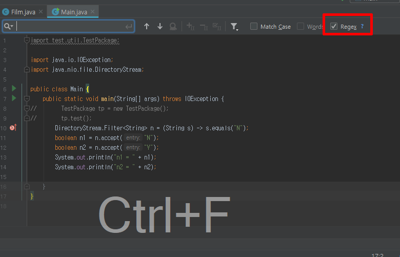 |
| 2 | 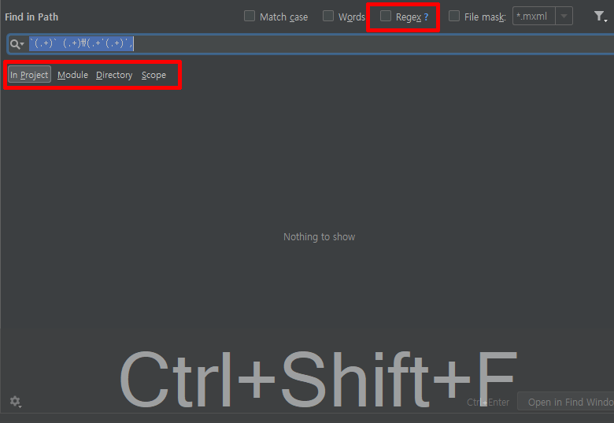 |
| 3 | 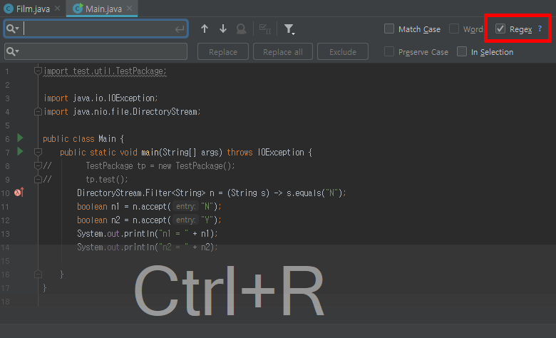 |
| 4 | 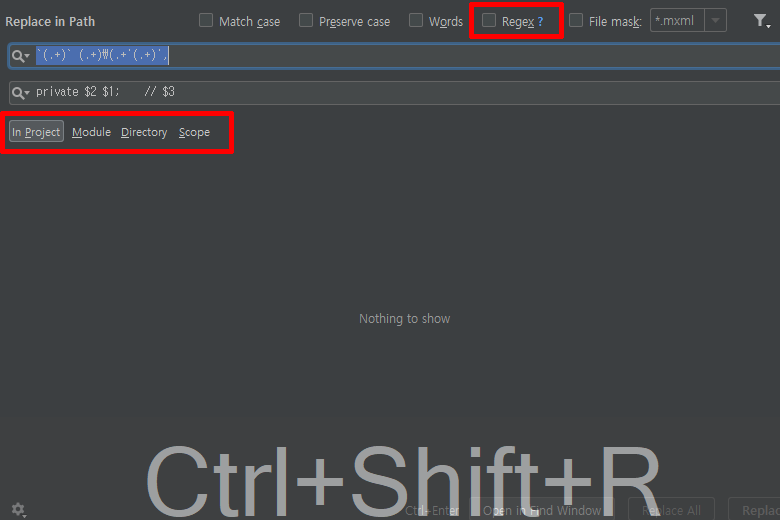 |


## JUnit 검증용 데이터 만들기
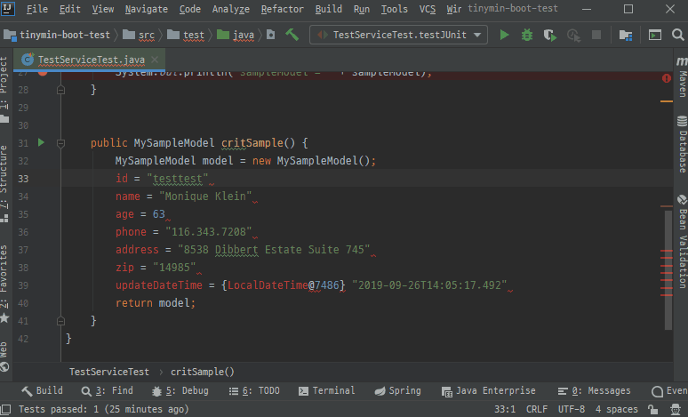

JUnit 테스트를 하려면 메소드 실행 결과를 내가 기대한 값과 비교하기 위해 상수 값을 가지는 비교용 객체를 생성해야 할 때가 있습니다.필드가 몇 개 없다면 단순히 타이핑으로 만들면 좋겠지만, 그렇지 않은 경우 값을 만들기가 매우 귀찮습니다. 저 같은 경우는 Local 환경에서 서버를 구동하여 Debug모드로 Break-Point를 걸고 객체의 값을 복사해와서 고정된 값을 가지는 객체를 만들고 있습니다.

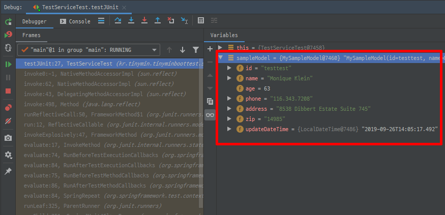

Debug 윈도우에서 값을 복사해 오면 아래와 같은 형태로 복사가 됩니다.

```
id = "testtest"
name = "Monique Klein"
age = 63
phone = "116.343.7208"
address = "8538 Dibbert Estate Suite 745"
zip = "14985"
updateDateTime = {LocalDateTime@7486} "2019-09-26T14:05:17.492"
```

이 값을 아래와 같은 형태로 1차로 만듭니다.

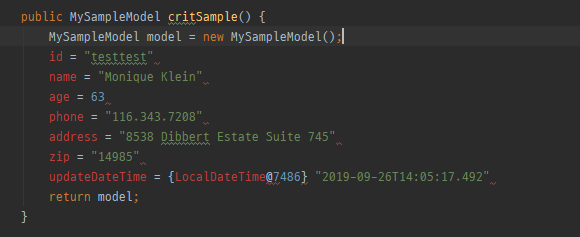

이 값들을 보면 =을 기준으로 값이 나뉘는 것을 알 수 있습니다. = 을 기준으로 우리는 아래와 같이 변환을 해야 합니다. 여기서 핵심은 변수명의 첫 글자를 대문자로 변경하는 것입니다.

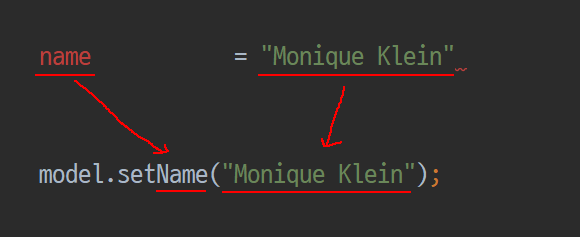

위 경우 IntelliJ가 제공하는 \u 를 사용하면 가져온 문자를 대문자로 변환 가능합니다. 외에도 몇가지 특수 기능이 있습니다. 제가 자주 쓰는 기능은 아래 4가지 입니다.

|   |  정규식 | 의미 |
|---|---|---|
| 1 | \u | 다음 1글자만 대문자로 변경 |
| 2 | \U | 다음에 오는 모든 문자를 대문자로 변경 |
| 3 | \l (소문자L) | 다음 1글자만 소문자로 변경 |
| 4 | \L | 다음에 오는 모든 문자를 소문자로 변경 |


사용한 정규식은 아래와 같습니다.
```
search : (.)(.+) = (.+)
replace : model.set\u$1$2($3);
```

검색할 때의 각 정규식은 아래와 같이 매칭 됩니다.
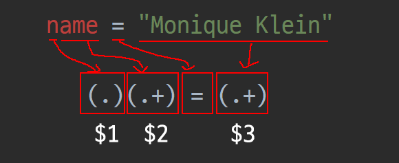

매칭 된 부분을 우리는 Setter 형태로 만들어야 하므로 위에 각 '$숫자'로 맵핑된 값을 가져와 치환될 문자열 _model.set\u$1$2($3);_ 로 값을 치환하게 됩니다. 이 때 _$1_ 항목은 대문자로 변경해야 하므로 _\u$1_을 사용하여 소문자 n이 대문자 N으로 변경됩니다.

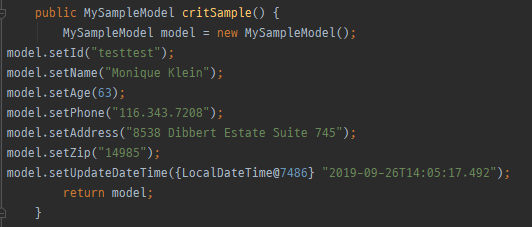


## DB스키마를 Java 모델로 변환하기
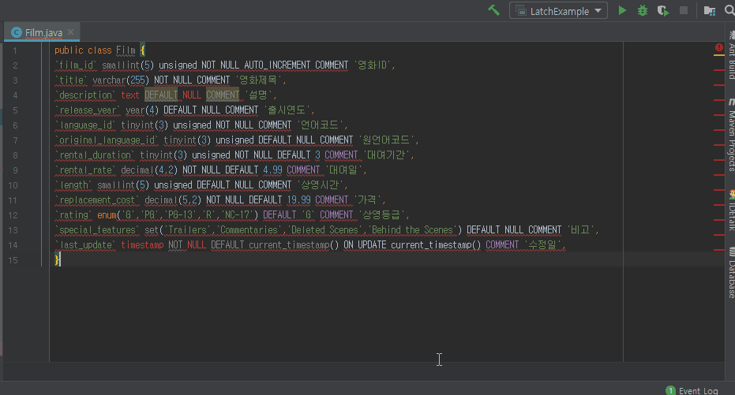

DAO 쪽 코드를 개발 하다보면 신규 테이블에 대해서 Java 모델을 새로 만들어야 하는 경우가 있습니다. 컬럼이 몇개 없는 경우에는 금방 끝나지만 많은 경우에는 일일이 코드를 작성하려면 여간 귀찮은게 아닙니다. 아래와 같은 스키마를 예로 Java 모델로 변경해 보겠습니다.

```SQL
CREATE TABLE `film` (
  `film_id` smallint(5) unsigned NOT NULL AUTO_INCREMENT COMMENT '영화ID',
  `title` varchar(255) NOT NULL COMMENT '영화제목',
  `description` text DEFAULT NULL COMMENT '설명',
  `release_year` year(4) DEFAULT NULL COMMENT '출시연도',
  `language_id` tinyint(3) unsigned NOT NULL COMMENT '언어코드',
  `original_language_id` tinyint(3) unsigned DEFAULT NULL COMMENT '원언어코드',
  `rental_duration` tinyint(3) unsigned NOT NULL DEFAULT 3 COMMENT '대여기간',
  `rental_rate` decimal(4,2) NOT NULL DEFAULT 4.99 COMMENT '대여일',
  `length` smallint(5) unsigned DEFAULT NULL COMMENT '상영시간',
  `replacement_cost` decimal(5,2) NOT NULL DEFAULT 19.99 COMMENT '가격',
  `rating` enum('G','PG','PG-13','R','NC-17') DEFAULT 'G' COMMENT '상영등급',
  `special_features` set('Trailers','Commentaries','Deleted Scenes','Behind the Scenes') DEFAULT NULL COMMENT '비고',
  `last_update` timestamp NOT NULL DEFAULT current_timestamp() ON UPDATE current_timestamp() COMMENT '수정일',
  PRIMARY KEY (`film_id`),
  KEY `idx_title` (`title`),
  KEY `idx_fk_language_id` (`language_id`),
  KEY `idx_fk_original_language_id` (`original_language_id`),
  CONSTRAINT `fk_film_language` FOREIGN KEY (`language_id`) REFERENCES `language` (`language_id`) ON UPDATE CASCADE,
  CONSTRAINT `fk_film_language_original` FOREIGN KEY (`original_language_id`) REFERENCES `language` (`language_id`) ON UPDATE CASCADE
) ENGINE=InnoDB AUTO_INCREMENT=1001 DEFAULT CHARSET=utf8
```

주어진 스키마에서 1차적으로 필요한 요소를 찾아냅니다. 아래와 같이 변수명으로 쓸 컬럼명과 변수타입에 해당하는 컬럼의 데이터 타입, 그리고 없어도 되긴 하지만, 주석으로 쓸 컬럼 코멘트까지 총 3가지를 뽑습니다.
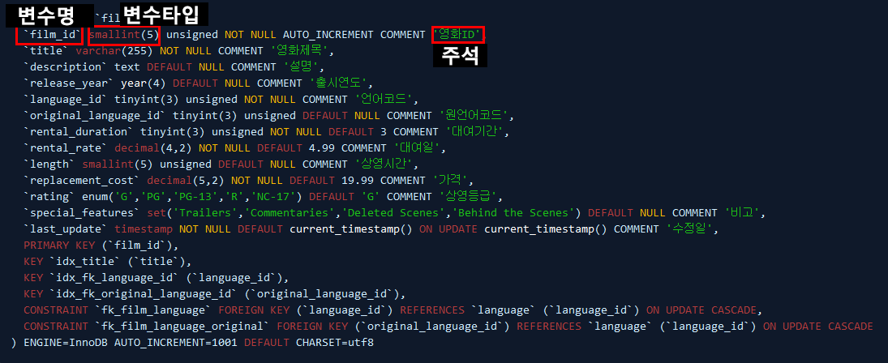


위를 기준으로 패턴을 만들면 아래와 같습니다.
```
`(.+)` (.+)\(.+'(.+)',
```

위 패턴은 각각 아래와 같이 매칭 됩니다. 또한 ( ) 안에 있는 문자열은 순서대로 $1, $2, $3에 매핑 됩니다.
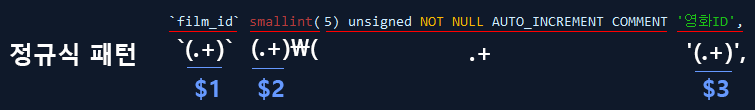


이를 아래와 같이 [ private $2 $1;    // $3 ] 으로 변환하게 되면 스키마를 Java 모델로 변환하게 됩니다.
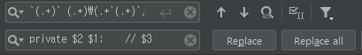


1차적으로 변환된 코드는 아래와 같으며, 이렇게 만든 상태에서 몇가지 예외 케이스를 다듬으면 금방 Model 객체를 만들 수 있습니다.
```Java	
public class Film {
    private smallint film_id;    // 영화ID
    private varchar title;    // 영화제목
    `description` text DEFAULT NULL COMMENT '설명',
    private year release_year;    // 출시연도
    private tinyint language_id;    // 언어코드
    private tinyint original_language_id;    // 원언어코드
    private tinyint rental_duration;    // 대여기간
    private decimal rental_rate;    // 대여일
    private smallint length;    // 상영시간
    private decimal replacement_cost;    // 가격
    private enum rating;    // 상영등급
    private set special_features;    // 비고
    private timestamp NOT NULL DEFAULT current_timestamp() ON UPDATE current_timestamp last_update;    // 수정일
}
```

## 정규식으로 검색하기
개발을 하다보면 분명히 초면인 코드를 만나게 됩니다. 이럴 땐 소스 검색을 자주하게 되는데, 이 때도 정규식을 이용하면 원하는 코드를 쉽게 찾을 수 있습니다. IntellJ로 검색은 2가지가 있습니다.

  - 현재 파일 검색 (Ctrl + F)
  - 프로젝트 전체 검색 (Ctrl + Shift + F)
  
몇 가지 예를 통해 검색 케이스를 살펴 보겠습니다.

### 케이스1. _cache_라는 글자를 포함하는 메소드만 검색하기

메소드를 검색하려면 다음과 같은 특징을 패턴으로 나타내면 됩니다.
  
  - 메소드는 대부분 private 또는 public 시작한다.
  - 메소드 헤더의 끝은 대부분 { 로 끝난다.

위 2가지 사항을 기준으로 패턴을 만들면 아래와 같습니다.

```
(public|private).*cache.*\{ 
```

### 케이스2. @Autowired 가 적용 된 Service 만 검색하기

 - \n? : 물음표를 붙임으로써 개행문자열이 있을 수도 있고 없을 수도 있음을 의미한다.
 - .+  : 임의의 문자열 1개 이상이 반복 됨을 의미한다.
 
 ```
 @Autowired\n?.+Service
 ```
 
 ### 케이스3. 특정 숫자 이상의 숫자 찾기
 
 보통 정규식에서 숫자는 [0−9]로 표현을 하지만 IntelliJ 에서는 \d를 사용할 수 있습니다. 이를 이용해서 특정 숫자 이상의 수를 검출 할 수 있습니다.
예를 들어 50,000 이상의 수를 검출하려면 아래와 같은 조건을 생각해볼 수 있습니다.

    IntelliJ에서 숫자는 \d

    로 표현 가능하다.
    50,000 이상의 숫자는 5자리이다.
    자바7부터 숫자에 '_'를 허용하므로 중간에 '_'가 있을 수있다.

이 조건으로 패턴을 만들면 아래와 같습니다.

```
5\d_?\d\d\d
```

만약 5만 ~ 10만 사이의 수를 구하려면 아래와 같이 표현이 가능합니다.

```
[5-9]\d_?\d\d\d
```

## 마치며

정규식을 꼭 코드 안에 특정 패턴을 검출하는 용도로만 쓰는 것보다 단순 반복 작업을 정규식으로 처리하면 훨씬 효율적으로 개발을 할 수 있게 됩니다. 이 글을 통해 정규식에 흥미를 가질 수 있으시면 좋겠습니다.
